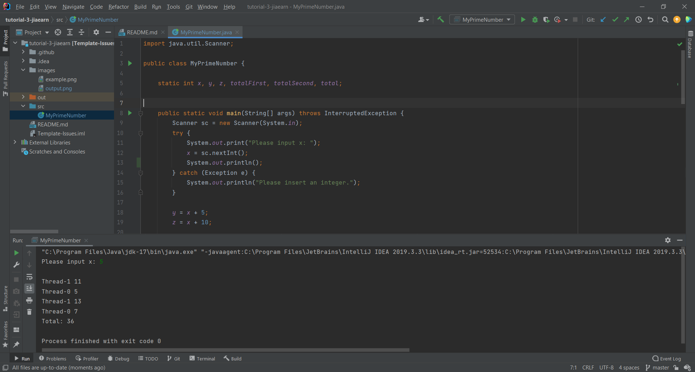

## Your Info:
1. Matric Number: 269509
2. Name: Tan Jia Earn


## Instruction:

1. Watch the video below:

   https://youtu.be/UbtBFeqRY1A

2. Then write a Java program to start __TWO (2)__ threads by `Method Reference` where:
    * 1st thread will display prime numbers between x and x + 5.
    * 2nd thread will display prime numbers between x + 5 and x + 10.
   
3. Then display the total of the prime numbers for both threads. 

4. x is integer number and MUST be input from the keyboard.

5. The program file which has the main method should be named `MyPrimeNumber.java` and place in the `src` folder.

6. Screenshot the result and upload to this repo too.

7. Watch the video to clone, add, commit and push a repository to GitHub: https://youtu.be/RXV3Yusr0SI

## Example of the output
```
Please input x: 5

Thread-0: 5
Thread-1: 11
Thread-0: 7
Thread-1: 13
Total: 36
```

## Your Output/Result

 